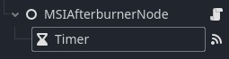

<p align="center">
  
</p>

# Godot MSI Afterburner

Small GDExtension plugin that allows to retrieve data from MSI Afterburner, supports graphs minimum and maximum limits.
Windows 32 bit and 64 bit only.

## How to use

> **Make sure to have MSI Afterburner running in the background!**

Search for MSIAfterburnerNode and add it to your scene, then add a script.
It's best to add a `Timer` and connect the `timeout()` signal to your node, like this:


In your script, poll the data on every timeout, then you can display it (if available):
```swift
extends MSIAfterburnerNode

func on_timer_timeout():
	poll()
	
	if not data.is_empty():
		print(data[&"RAM usage"].value)
```
The name entry of the dictionary corresponds to the source name in MSI Afterburner.

`poll()` returns `true` if the data was retrieved successfully, else `false`.

The structure of `data`:
```json
{
	&"<source_name>": {
		"value": float,
		"minLimit": float,
		"maxLimit": float,
		"unit": String
	},
	...
	&"<gpu_id>": "<GPU name>"
}
```

Try out the demo scene for an example.

## Building

<u>Requirements</u>:
* Python
* SCons

Clone the repository along with the godot-cpp submodule.
On the root directory, open the command prompt and run:
`python -m SCons platform=windows`
> To build for 32 bits, add `arch=x86_32` at the end of the command.

Alternatively, you can open the folder in Visual Studio Code and press Ctrl + Shift + B and select the desired build task.